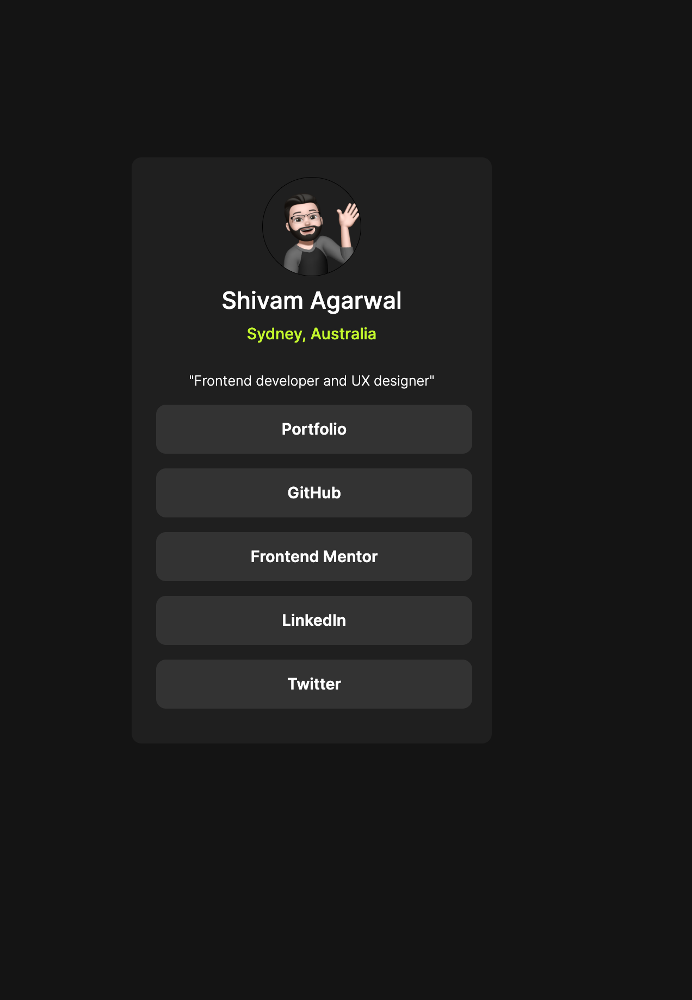
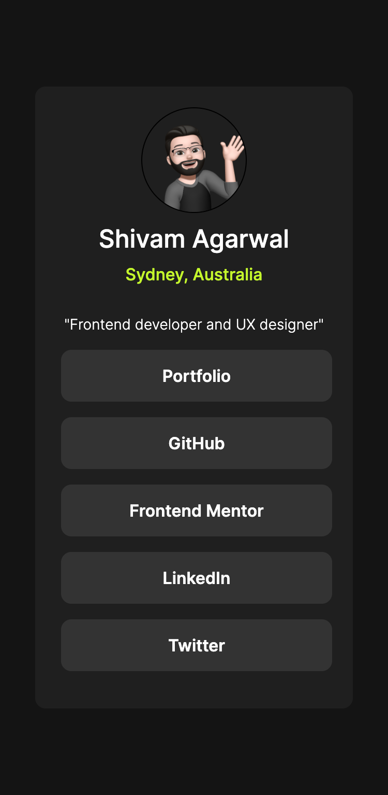

# Social links profile 

## Table of contents

- [Overview](#overview)
  - [The challenge](#the-challenge)
  - [Screenshot](#screenshot)
  - [Links](#links)
  - [Built with](#built-with)
  - [What I learned](#what-i-learned)
  - [Continued development](#continued-development)
- [Author](#author)

## Overview

It's a design component which is a collection of links to my social media profiles, coded in HTML and CSS. 

### The challenge

Users should be able to:

- See hover and focus states for all interactive elements on the page

### Screenshot

### Links

- Solution URL: (https://github.com/undrthegraveyard/Social-links-profile)
- Live Site URL: (https://undrthegraveyard.github.io/Social-links-profile/)

### Built with

- HTML5
-CSS
 - Hover state 
 - Custom fonts
 - Class selector
 - Type selector
 - ID selector
 - Flexbox 

### What I learned

 - Hover state 
 - Custom fonts
 - Flexbox 

### Continued development

My focus would be on using flexbox more efficiently in the future projects to make the designs more responsive, and fluid.  

## Author

- Website - [Shivam Agarwal](https://www.shivamagarwal.au)
- Frontend Mentor - [@undrthegraveyard](https://www.frontendmentor.io/profile/undrthegraveyard)
- Twitter - [@shivam_agarwaal](https://twitter.com/shivam_agarwaal)
